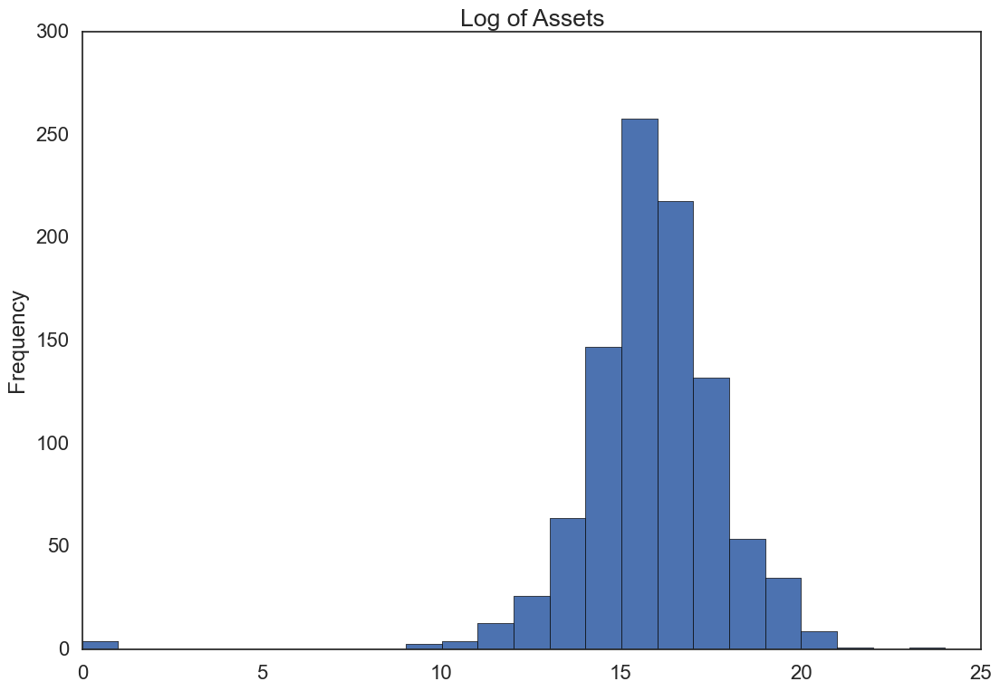
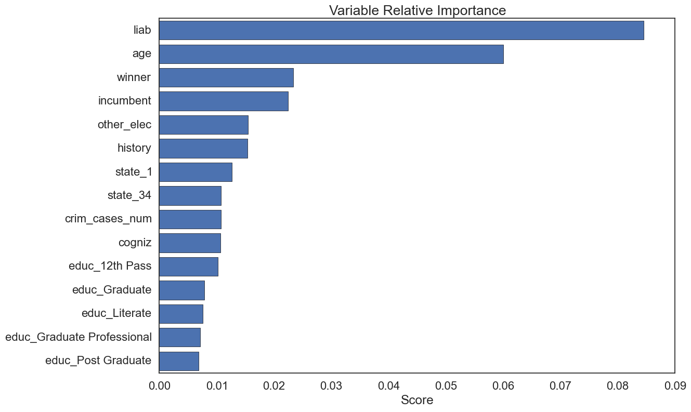
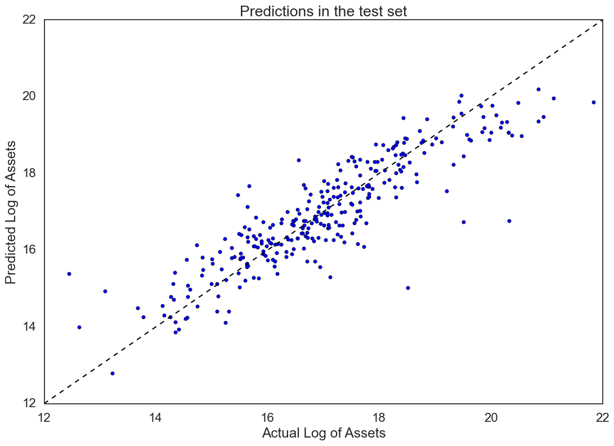
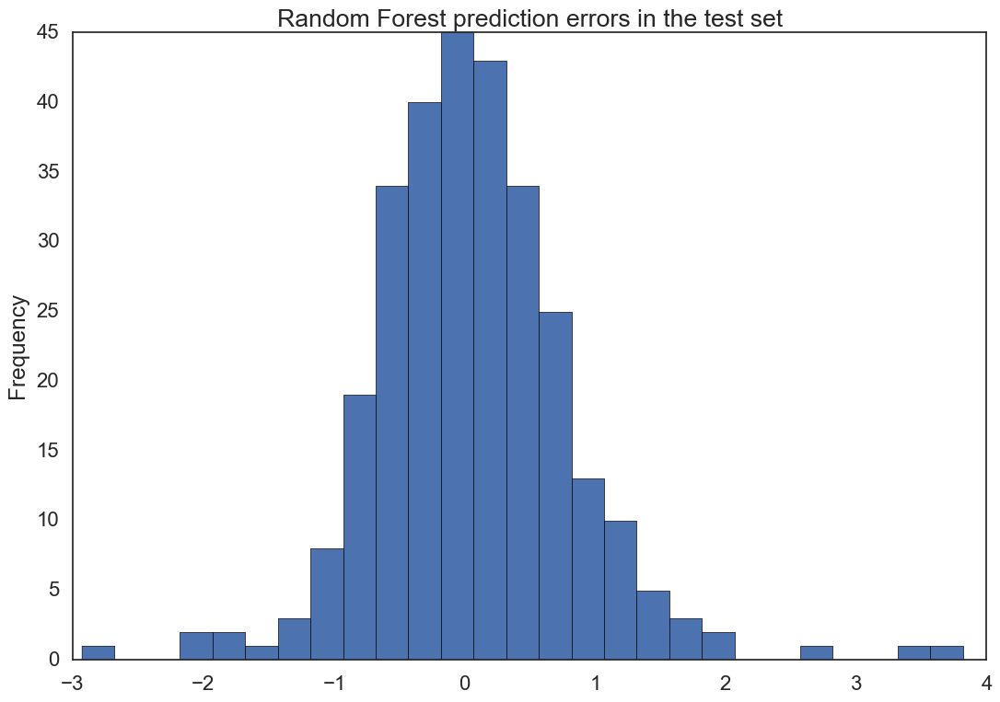

# Asset Prediction using two consecutive elections data at the Lok Sabha level

### The experiment

For candidates that participated in two consecutive elections processes, 2004 - 2009 or/and  2009 - 2014, we want to predict the level of assets in their second election process given the level of assets during their first election process and other variables. Our ultimate intention is to establish which candidates have higher propensity to increase their assets in an abnormal way.

### The data

We will be using data from three election periods, each observation is a candidate that has information available for two consecutive elections, this is mostly the same data we have used in other sections. As mentioned before, one of the biggest limitations of our data is that there are no candidates that participated in consecutive elections and lost in both of them, we only have candidates that won in at least one of the consecutive periods.

**Crossing data among different periods**

Data was disperse among the three election periods, so part of the challenge was to cross this data and find the candidates that participated in consecutive elections. Crossing data using the name of the candidate didn't work, since names content and format changed across different periods. Finally, through the scrape of additional web pages we were able to came up with a data base that has 969 observations, containing information about the 2004/2009 and 2009/2014 periods a the Lok Sabha level.

**Dealing with logs**

Instead of just using the plain-vanilla level of assets, we decided to use the log of these. This will smooth the data from the huge disparities that we found in the level of assets for different candidates. Also, using log measures the relative increase since is an approximation to working with percentage changes.

<Hist_Log_Assets>

If we take a look at the log of Assets level we realize that the disparities we find are enormous (just to have an idea the difference between $$e^{20}$$ and $$e^{15}$$ is in the order of several hundreds of millions) . Once we converted the level of assets to log there standardizing the data didn't produce much difference in our results; magnitudes of all our variables are relatively small, most of the time they are binary variables of integers between 0 and 50.

**Dealing with categorical variables and sparse data**

Our data set has a mixture of numerical and categorical variables, these one can be hard to treat if they have too many levels; in the end, a categorical variable with "L" levels will add "L-1" binary predictive variables . One of the options available to deal with this problem is to build clusters using several categorical variables. In our particular case, we didn't find any particular intuitive sub group of categorical variables to build clusters, since all categorical variables with more than 35 levels were all from a very different nature from each other. Finally we opted for encoding and using all the available variables and then perform variables selection methods to realize which variables were important and which ones were not. We used R to perform a stepwise regression method and python to measure the relative importance of variables through the use of a Random Forest Regressor. There was a very decent amount of overlap between the two different methods. We exclude the previous assets level in this ranking since is by far the most relevant variable, as we might have presumed.

<RF_Var_Imp.png>

In the stepwise procedure variables such as age, history, winner and other_elec were also pretty important too.

### The models

**The Baseline**

The first thing we did was try to find a smart baseline. Since the correlation between the level of assets of two consecutive periods is pretty high, we decide to use this as a benchmark. Our baseline is simple regression of the form: $$\hat{assets_{t}}=\beta_0+\beta_1*assets_{t-1}$$ .

**The Lasso Regression**

We used cross validation in order to find the optimal penalization parameter $$\alpha$$ (that multiplies the L1 term), which turned out to be 0.01. After regularization the algorithm dropped 15 variables.

**The Stepwise Linear Regression**

To find the stepwise subset of variables we used the R software, once we had the names of the variables within this subset we run the regression in python and compare its results with the other models. The variables selected by the stepwise algorithm were: assets, winner, age, other_elec, history and education.

**The Random Forest Regression**

We used all the available variables to run this algorithm. Through cross validation we optimize the number of features to consider when looking for the best split ("max_features"). Finally, we train using the optimal "max_features" to train our definitive model.

### The Results

We compared the results using both in sample and out of sample metrics. We chose the MSE (mean squared error) as the principal metric to compare. All models proved to decently stable in and out of sample. 

**In sample results**

To check behavior in sample, we used the train set and five fold cross validation, we obtained the following results:

| Model                      | $$\mu_{MSE}$$ | $$\sigma_{MSE}$$ |
| -------------------------- | :-----------: | :--------------: |
| Baseline                   |     1.24      |       0.21       |
| Lasso Regression           |     1.18      |       0.23       |
| Stepwise Linear Regression |     1.17      |       0.27       |
| Random Forest Regression   |     0.83      |       0.11       |

**Out of sample results**

Finally we check the results in the test set for all the models

| Model                      |  MSE  |
| -------------------------- | :---: |
| Baseline                   | 1.075 |
| Lasso Regression           | 1.038 |
| Stepwise Linear Regression | 1.037 |
| Random Forest Regression   | 0.58  |

**The Random Forest Regression**

As we see the Random Forest regression performs considerably better than the other models. Let's take a look to the predictions in the test set:

<RF_Pred_Test>

Results look good, but we would finally like to check the behavior of our model prediction errors:

<RF_Errors>

Errors in our prediction look respectably normal and centered at zero. If we would have tho chose a model to predict assets behavior for candidates this would be our model of choice.