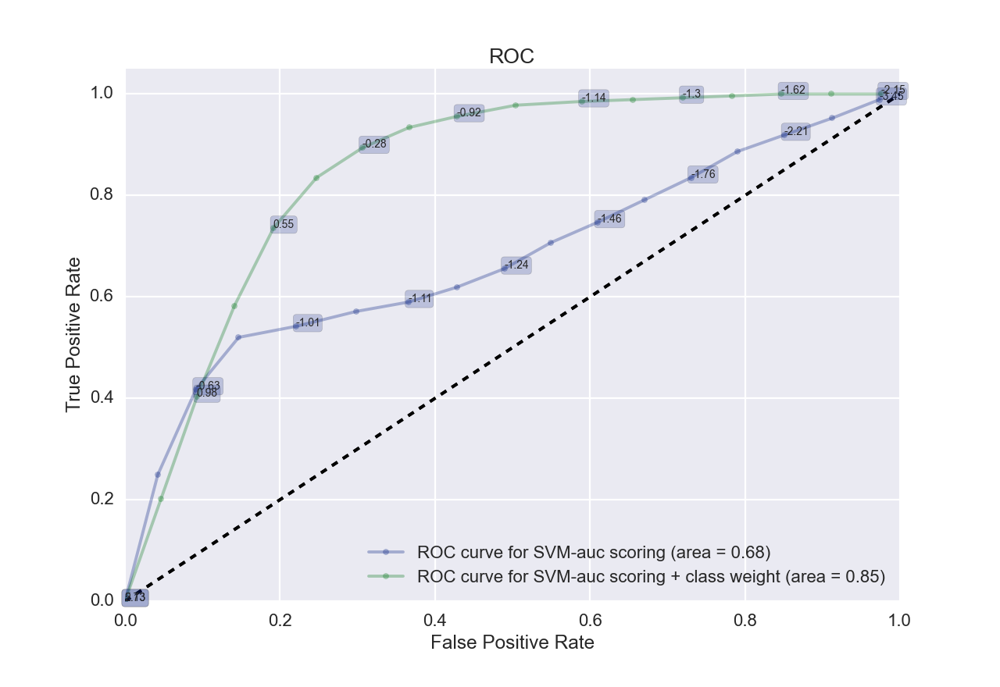
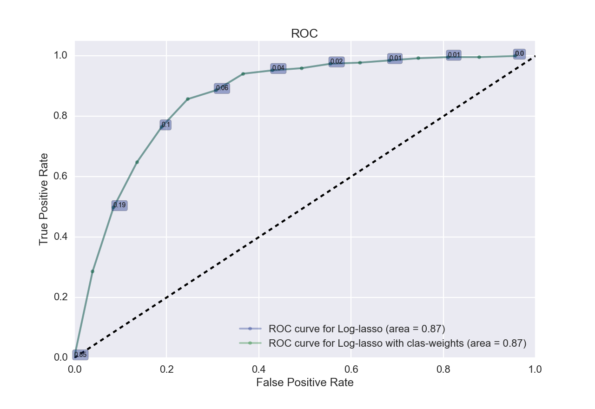
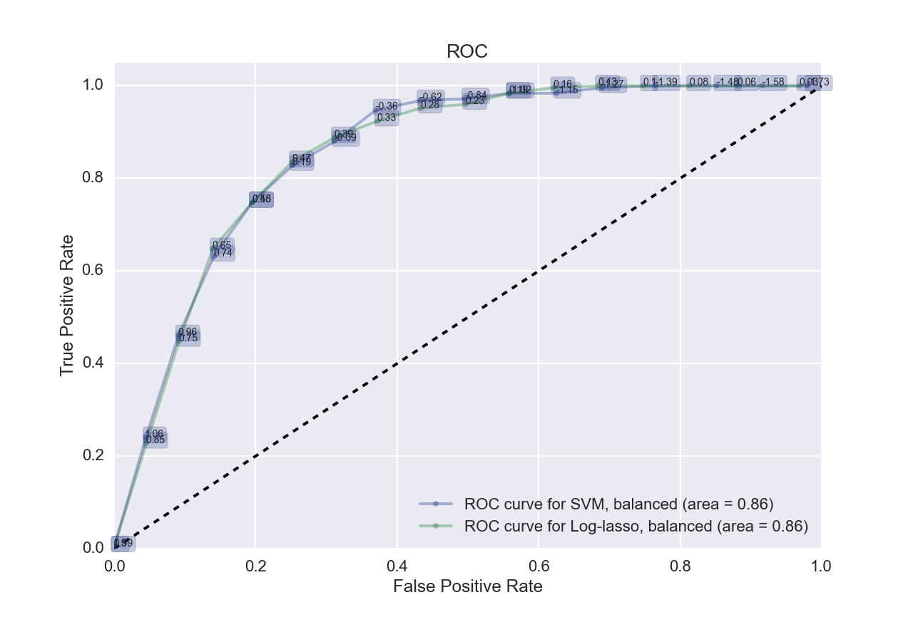
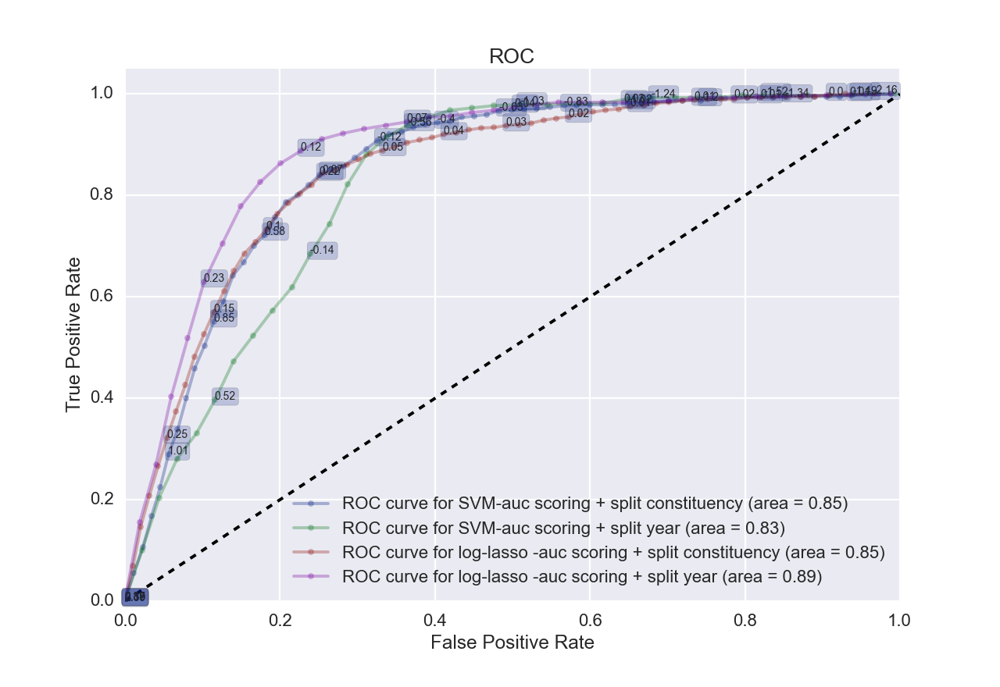
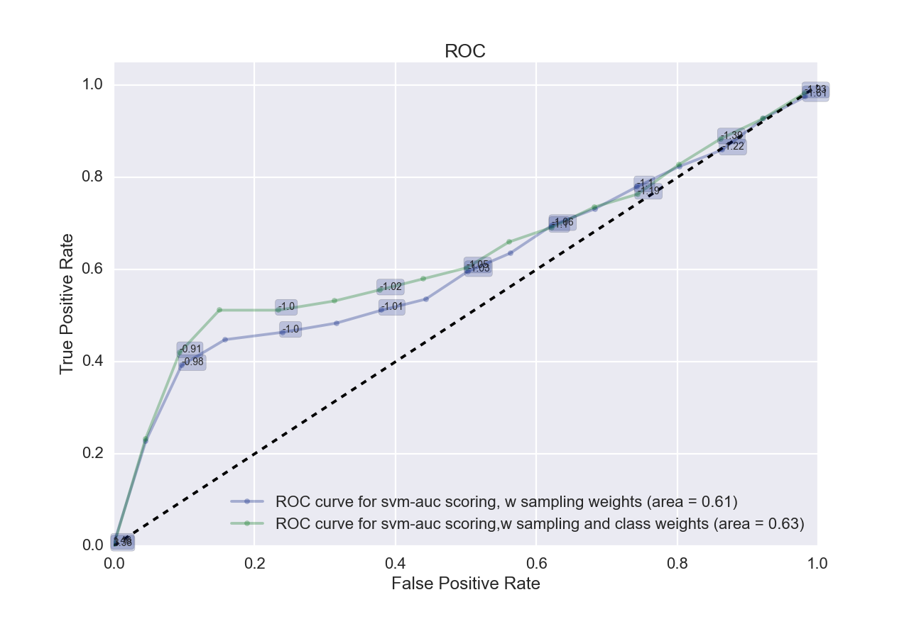

#### Support Vector Machine (SVM) and Logistic Regression with Lasso Regularization

**Pre-processing**

We log-normalize asset variables and remove observations with zero total assets for this set of analyses. The idea is to treat these candidates as missing data since it is not credible that candidates, in the Indian context where campaigns must be self-financed, would have zero cash or deposits in financial institutions. Therefore, we assume that they must have avoided reporting altogether. 

All the columns are then standarized with zero mean and unit standard deviation. This process is repeated for each type of train-test split ( by year, by constituency or the classic way as described above in the random forest method).

**Tuning**

For each of the two models, we tune using a range of hyper-parameters ‘C’ within a 5-fold cross-validation to identify the amount of slack the model can afford. The grid-search chooses the optimal hyper-parameters based on the ROC area under the curve metric (sklearn.metrics.roc_auc_score) as its scoring since we have a highly asymmetric dataset with a 92-8 split between losers and winners, respectively, of the Lok Sabha election. Without this, accuracy score would have been used as the default optimization metric, in which case, it is optimal for the model to classify every candidate as losers. For instance, in the case of SVM, the model would place the separating hyper-plane all the way at the edge of the data, classifying everything as one type. The following result is an example of the confusion matrix, with no positives, even if the accuracy on the test set was 93%, better than the default probability.

|                      | Predicted Negative | Predicted Positive | 
| -------------------- | ------------------ | ------------------ | 
| **Actual Negative**  | 3146               | 0                  | 
| **Actual  Positive** | 250                | 0                  | 

Although we tried both class and sample weights, we ended up using class-weights in most of the model variations. This was useful because some features are more complete/sparse than the other and the weights help make feature’s effect more proportional to their frequencies. 

##### ***Models: SVM and Log-Lasso***

We use scikit learn’s SVC() classifier with the default RBF (Radial Basis Function) kernel and LogisticRegression with Lasso penalty  with the following variations:

1. With and without class-weights
   
2. Training on a balanced and partially balanced subsample of the dataset
   
3. Train-test split by year and by constituency
   
   ​

**Performance**

***SVC*** 

The results from our SVC classifier is fairly poor as expected. However, using class-weights, we improve our predictions but with a higher number of false positives. As the ROC curves below shows, the AUC for SVC without weights is 0.63, which improves to 0.85 with class-weights.

1. | SVC                  | Predicted Negative | Predicted Positive | 
   | -------------------- | ------------------ | ------------------ | 
   | **Actual Negative**  | 2973               | 150                | 
   | **Actual  Positive** | 200                | 73                 | 

| SVC with class weights | Predicted Negative | Predicted Positive | 
| ---------------------- | ------------------ | ------------------ | 
| **Actual Negative**    | 2274               | 849                | 
| **Actual  Positive**   | 37                 | 236                | 

***Log-Lasso Classifier***

The Lasso regularization method does both parameter shrinkage and variable selection such that it selects the most important features by allowing the coefficients of certain features to reduce all the way to zero. The AUC, accuracy and error rates were identical between the class-weighted and non-weighted models. 

| Log-lasso            | Predicted Negative | Predicted Positive | 
| -------------------- | ------------------ | ------------------ | 
| **Actual Negative**  | 3077               | 46                 | 
| **Actual  Positive** | 251                | 22                 | 

***SVC and Log-Lasso with Balanced Data***

When using a balanced dataset we get the following results for SVC and log-lasso. Although the AUC is identical for both models, the false positive rate is higher for the SVC than the log-lasso. This performance is not better than the unbalanced set because of the small training set size which only had over 1000 observations. 

| Balanced SVC             | Predicted Negative | Predicted Positive | 
| ------------------------ | :----------------: | :----------------: | 
| **Actual Negative**      |        2227        |        919         | 
| ****Actual  Positive**** |         38         |        212         | 

| Balanced Log-lasso     | Predicted Negative | Predicted Positive | 
| ---------------------- | :----------------: | :----------------: | 
| **Actual Negative**    |        2423        |        723         | 
| **Actual  Positive**** |         48         |        202         | 

We also tried running the classifiers on a partially balanced training set (2/3 losers) but obtained very similar results to the balanced data runs discussed above.

***SVC and Log-Lasso: Train-Test Split by Constituency and Year***

The performance of the the two classifiers by type of split in terms of accuracy, AUC and false positive and false negative rates are given below. The log-lasso does better than the SVC in all the cases. This is expected as SVC’s do poorly in unbalanced datasets. But as we saw above, due to the tiny size of the balanced training set, it does not perform better than the unbalanced set.

| Classifier | Split Type   | Accuracy on Train | Accuracy on Test | 
| ---------- | ------------ | ----------------- | ---------------- | 
| SVC        | Constituency | 0.72              | 0.71             | 
| SVC        | Year         | 0.81              | 0.78             | 
| SVC        | Candidates   | 0.76              | 0.74             | 
| Log-lasso  | Constituency | 0.92              | 0.92             | 
| Log-lasso  | Year         | 0.90              | 0.93             | 
| Log-lasso  | Candidates   | 0.92              | 0.91             | 

***Confusion Matrices***: The SVC results have much higher false positive rates than the log-lasso for both types of splits. On the other hand, the log-lasso classifiers have higher false negatives for both types of splits. As indicated by the accuracy scores given above, the magnitudes of the errors is higher for SVC than for log-lasso. 

| SVC - Constituency   | Predicted Negative | Predicted Positive | 
| -------------------- | ------------------ | ------------------ | 
| **Actual Negative**  | 8722               | 3757               | 
| **Actual  Positive** | 125                | 916                | 

| Log - Constituency   | Predicted Negative | Predicted Positive | 
| -------------------- | ------------------ | ------------------ | 
| **Actual Negative**  | 12164              | 105                | 
| **Actual  Positive** | 988                | 58                 | 

| SVC - Year               | Predicted Negative | Predicted Positive | 
| ------------------------ | ------------------ | ------------------ | 
| **Actual Negative**      | 5652               | 1457               | 
| ****Actual  Positive**** | 179                | 259                | 

| Log-Year                 | Predicted Negative | Predicted Positive | 
| ------------------------ | ------------------ | ------------------ | 
| **Actual Negative**      | 6957               | 152                | 
| ****Actual  Positive**** | 366                | 72                 | 

**Future Enhancements**

We attempted embedding sampling weights to account for imbalance in the data. However, it did not do well as expected which could be because of poor suitability of the features used or poor implementation.  The following ROC curves show the results of the SVC predictions when using sampling weights. We think the model can be improved by using the correct/better sampling weight techniques. 

The SVC() models can be further enhanced using feature selection and regularization based on gamma parameters as well. Gamma parameters define the distance between the hyperplane and support vectors. In our modeling, gamma the parameter is auto-tuned.

